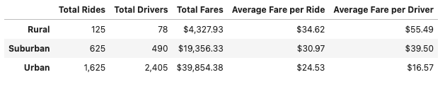
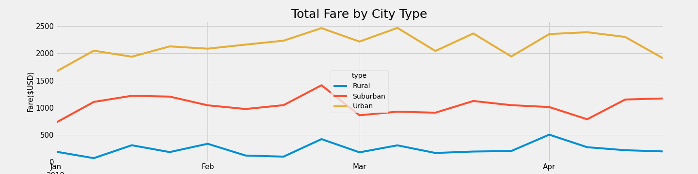

# **Module5 Challenge - PyBer_Analysis**
## **Module 5 PyBer_Analysis Creating Charts using Python Script, Pandas Library, and Matplotlib in Jupyter Lab**

## **Overview of the Project**

#### The purpose of this analysis is to provide decision-makers at PyBer with summarized ride sharing information about number of rides, number of drivers, total fares, average fare per ride and average fare per driver by city types, i.e. Urban, Suburban and Rural.  This information provides comparison data about how PyBer ride sharing business performs in different types of cities and could help PyBer's decision-makers to optimize their business strategy and further the growth of PyBer's ride sharing business.

## **Analysis and Results**

### **Analysis**

#### The first step is summarizing the total number of rides, total number of drivers, total amount of fares, as well as average fare per ride and average fare per driver and grouping them by Urban, Suburban, and Rural city types.  This summarization is accomplished by using groupby function to obtain Total Rides, Total Drivers, and Total Fares grouped by City Types (Urban, Suburban, and Rural).  Next, Average Ride per Fare and Average Driver Fare for all City Types are calculated.  Finally, a PyBer Summary Data Frame is created to display all the data in a tabular format to provide clear and concise information.

#### [PyBer Summary Data Frame](https://github.com/davidzachie/Module5-PyBer_Analysis/blob/main/analysis/Pyber_Summary_DF.png)

#### The second step is creating a multiple-line chart of the total weekly fares for each city type.  The chart is created by first grouping fare data by city type and date.  Then a pivot table is created showing date as index, city type as columns, and fare as values.  Finally, resample function is used to create a data frame showing the sum of fares for each week by city type and to create a multiple line graph that shows the total fares for each week by city type for the period of January 1, 2019 to April 28, 2019.

#### [Total Fare by City Type Chart](https://github.com/davidzachie/Module5-PyBer_Analysis/blob/main/analysis/Pyber_fare_summary.png)

### **Results**

#### Based on the data from the above Data Frame the conclusions are:
#### Urban city type has the most number of drivers and rides and total fares.  However, Urban cities have the lowest average of fare per ride and fare per driver.
#### Suburban city type is in the middle position having the 2nd most drivers, rides and total fares.
#### Rural city type has the least number of drivers and rides and total fares.  However, Rural cities have the highest average of fare per ride and fare per driver.

#### The Total Fare by City Type Chart also exhibits the same conclusion where Urban cities consistently generate the highest amount of weekly fare, Suburban cities in the middle, and Rural cities earn the least amount of weekly fare.

### **PyBer Challenge codes can be seen on this link:** [Pyber Challenge](https://github.com/davidzachie/Module5-PyBer_Analysis/blob/main/PyBer_Challenge.ipynb)

## **Summary and Recommendations**

### **Summary**

#### The results show the amount of fares that are generated is based on what city type the passenger is catching a ride in. We can conclude that the Urban cities consitently generate the highest total fare because there is a higher number of population thus passengers, more drivers, and greater number of rides.  Although, the average fares per ride and driver are the lowest, which probably due to competition against other ride sharing companies and public transportations as well as shorter distance rides.  On the other hand, the Rural cities earn the least total fare probably due to lack of passengers and drivers.  But, the the average fares per ride and driver are the highest because distance is most likely longer making the average fare per ride & driver the most out of all city types.

### **Recommendations**

#### Recommendations to address disparities among the city types:

#### 1. Increase fare charge in Suburban cities to generate more total fare and revenue since competition is probably not so fierce but at the same time there is still     sufficient demand for ride sharing service.

#### 2. Evaluate how much competitors charge in Urban cities.  Experiment with making small changes in fare with the strategy either charging less but gaining bigger       market share or mainatining the current market share but charging slightly higher fare.

#### 3. Launch special promotions or fare discount during off peak months (By looking at the Total fare by City Type Chart) to consistently maintain higher weekly total fare every month.
